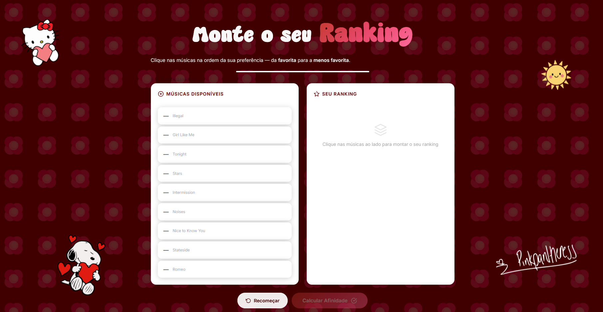
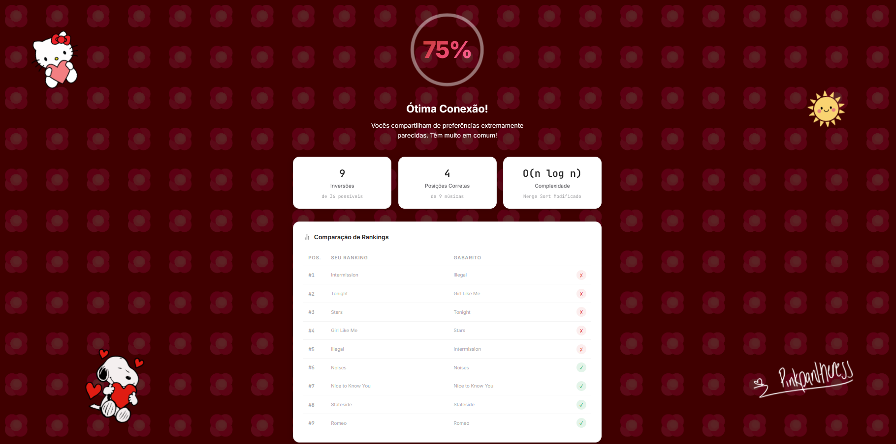
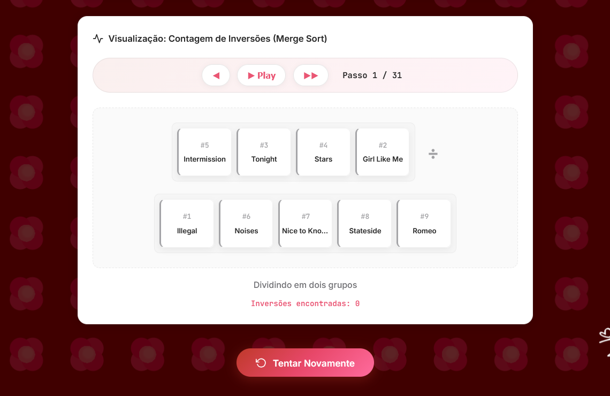

# Dividir-e-Conquistar_RankPink

**Número da Lista**: 24<br>
**Conteúdo da Disciplina**: Dividir e Conquistar<br>

## Alunos
|Matrícula | Aluno |
| -- | -- |
| 23/1039113  |  Leonardo Porporati Barcellos |
| 23/1039187  |  Yzabella Miranda Pimenta |

## Sobre 
Este projeto implementa o algoritmo de **Contagem de Inversões**, da estratégia de **Dividir e Conquistar** baseada no Merge Sort. O objetivo é calcular a similaridade entre dois rankings de músicas.

O usuário cria seu próprio ranking para uma lista de músicas pré-definida. Em seguida, o algoritmo compara o ranking do usuário com um ranking "gabarito". A quantidade de "inversões" (pares de músicas que estão em ordem oposta entre os dois rankings) é usada para calcular uma porcentagem de "afinidade musical".

Além do resultado, o projeto oferece uma visualização interativa que demonstra passo a passo como o algoritmo funciona, tornando o processo didático e fácil de entender.

## Screenshots

<p align="center">
  
  <br>
  <sub>Tela inicial para o usuário montar o ranking de músicas</sub>
</p>

---

<p align="center">
  
  <br>
  <sub>Tela de resultados com a afinidade e estatísticas</sub>
</p>

---

<p align="center">
  
  <br>
  <sub>Visualizador do algoritmo de Merge Sort e contagem de inversões</sub>
</p>


## Instalação 
**Linguagem**: JavaScript, HTML e CSS  
**Framework**: Não foi utilizado  
**Pré-requisitos**: Um navegador web moderno e um servidor local (como o Live Server do VS Code).

### Como rodar

1. Clone o repositório:
```bash
git clone https://github.com/projeto-de-algoritmos-2026/G24_Dividir-e-Conquistar_RankPink.git
cd G24_Dividir-e-Conquistar_PA-26.1
```

2. Inicie um servidor local na raiz do projeto. A forma mais simples é usando a extensão **Live Server** para Visual Studio Code:
    * Instale a extensão "Live Server" no VS Code.
    * Clique com o botão direito no arquivo `frontend/index.html`.
    * Selecione "Open with Live Server".

3. O navegador abrirá automaticamente no endereço correto, algo como:
```txt
http://127.0.0.1:5500/frontend/index.html
```

## Vídeo de Apresentação

<p align="center">
  Neste vídeo, apresentaremos o trabalho desenvolvido:
</p>

<p align="center">
  <a href="https://www.youtube.com/watch?v=NQnVwcll5nI" target="_blank">
    
  </a>
</p>